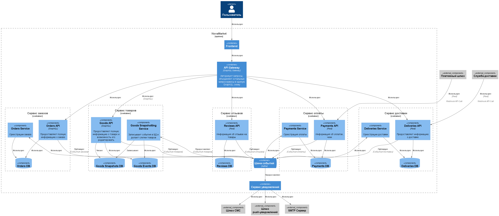

### **Название задачи:** Просмотр истории покупок
### **Автор:** Екатерина
### **Дата:** 09.09.2024
### **Функциональные требования**

|**№**|**Действующие лица или системы**|**Use Case**|**Описание**|
| :-: | :- | :- | :- |
| UC001 | Пользователь, Сервис заказов | Просмотр истории покупок | Информация о датах создания, стоимости и способе доставки |
| UC002 | Пользователь, Сервис заказов, Сервис оплаты, Сервис доставки | Просмотр подробной информации о заказе | Список товаров, количество, цена, итоговая сумма, способ доставки, оплаты и финальный статус |
| UC003 | Пользователь, Сервис оплаты | Просмотр чека заказа |  |
| UC004 | Пользователь, Сервис отзыва | Возможность оставить отзыв о товаре |  |
| UC005 | Пользователь, Сервис товаров | Возможность повторного заказа |  |

### **Нефункциональные требования**

|**№**|**Требование**|
| :-: | :- |
| NFR1 | Обработка до **40 000 заказов в день** |
| NFR2 | Время отклика 99 перцентиль < 1000мс |
| NFR3 | Время отклика 98 перцентиль ~300мс |

### **Решение**

**API Gateway** использует GraphQL Gateway, это позволит обеспечить удобный и быстрый доступ к данным и запрашивать только необходимые параметры в моменте из каждого микросервиса. Данный сервис так же будет отвечать за аутентификацию пользователей и централизированное кеширование запросов для уменьшения нагрузки на сервисы.

**Шина сообщений** использует Kafka и обеспечивает глобальную коммуникацию между всеми микросервисами в общей системе.

**Сервис товаров** состоит из нескольких компонентов: АПИ, сервиса снапшотов, БД событий и БД снапшотов. Данный сервис требует **CQRS** и **Event Sourcing** подхода к разработке. **Event Sourcing** был выбран для данного сервиса для того, чтобы пользователь в истории заказов мог получать информацию о товаре той версии, которую он приобретал в магазине, а не измененную. Это обеспечивает прозрачность и надежность для клиента, а так же простоту в управлении товаром продавцам. Для обеспечения высокой производительности сервиса было принято решение об использовании отдельной базы данных для хранения переодических снапшотов (Например, делать снапшоты не чаще 1 раза в день на товар, если были изменения). Микросервис снапшотов так же занимается чтением событий из шины и записью их в базу данных для полной истории.

**Сервис заказов** состоит из нескольких компонентов: АПИ, База данных и оркестратор процесса заказа, взаимодействуя с другими сервисами асинхронно посредством публикации и чтения событий из общей шины событий. Данный сервис реализует **CQRS** взаимодействие для обеспечения асинхронного процесса создания заказов.

**Сервис отзывов** состоит только из АПИ и БД, сохраняя и предоставляя доступ к отзывам о товарах. Публикация отзыва так же сопровождается отправкой события в общую шину сообщений. Данный сервис реализует **CRUD** взаимодействие с отзывами и последующей публикацией события.

**Сервис оплаты** состоит из АПИ, БД, микросервиса оркестрации оплаты. АПИ предоставляет доступ к статусам оплаты и чекам, а так же обрабатывает веб-хук запросы от внешнего шлюза оплаты для подтверждения или отмены оплаты. Сервис оркестрации отслеживает запросы на проведение оплат, сохраняет данные о чеках пришедшие через веб-хук запросы и публикует события о просроченных запросах на оплату. Данный сервис реализует **CQRS** взаимодействие для обеспечения асинхронного процесса оплаты.

**Сервис доставки** состоит из АПИ, БД и микросервиса оркестраци доставки. АПИ предоставляет доступ к информации о доставке, а так же обеспечивает коммуникацию между всей системой и внешними интеграциями со службами заказов. Данный сервис так же реализует подход **CQRS**.

### **Альтернативы**

В качестве альтернативного решения можно отказаться от БД снапшотов и воспользоваться средствами кеширования. Это упростит сервис товаров и время на его разработку, но потенциально может привести к проблемам производительности и высокому потреблению памяти при обращении к множеству различных товаров разных версией в один момент времени.

**Недостатки, ограничения, риски**

1. Непрерывное редактирование товаров продавцом может привести к росту БД снапшотов и снижению производительности системы записи снапшотов и увеличению времени ответа от АПИ, т.к. потребуется более длительное восстановление через события. *Возможное решение: выполнять оптимизацию базы снапшотов и удалять неактуальные и неиспользуемые версии снапшотов.*
2. Шина сообщений является глобальной точкой отказа. *Необходимо обеспечить высокую надежность и доступность данного узла системы за счет репликации.*
3. API Gateway так же является глобальной точкой отказа, при падении или замедлении данного узла, пользователи потеряют доступ ко всей системе. *Необходимо обеспечить высокую доступность и масштабируемость данного сервиса для выполнения высокого SLA продукта.*

